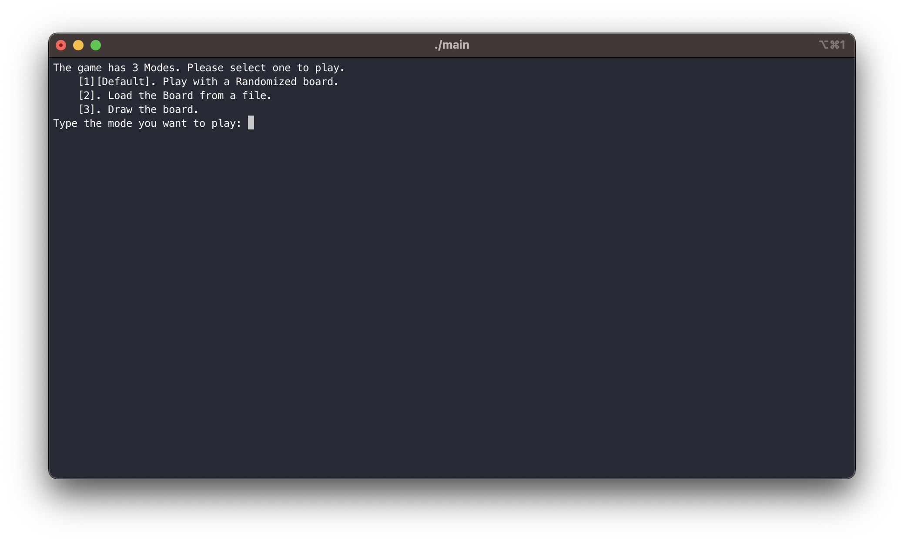
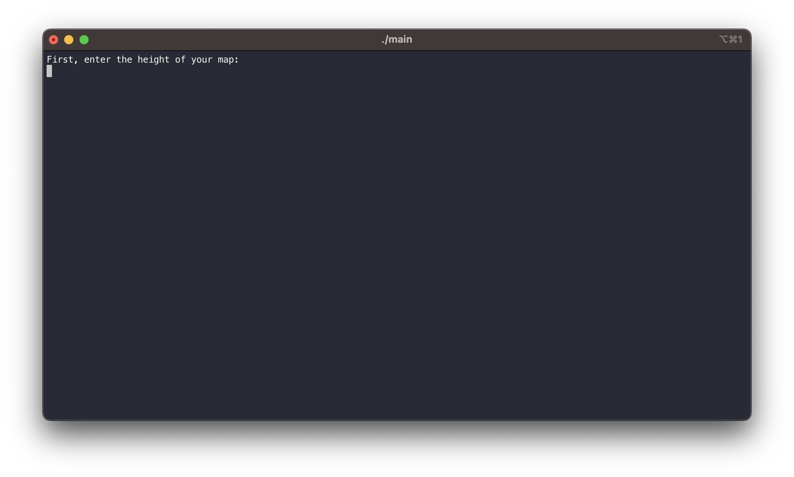
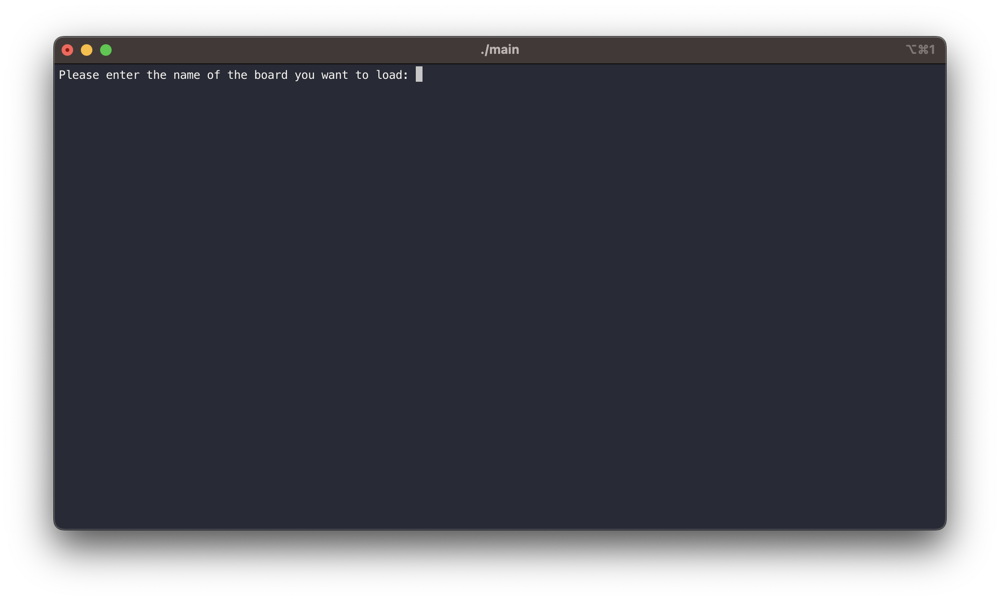
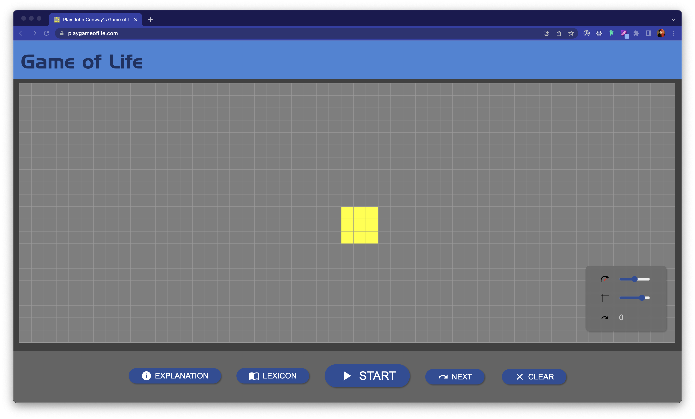
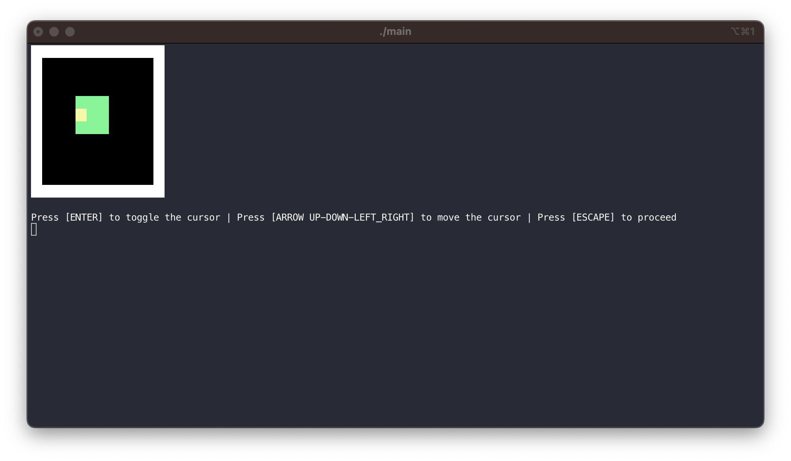

# "Life" Developer Documentation

## Table Of Content

1. Brief
2. List of Functions and Data Structures
3. How the game works
4. Compilation and Testing of the game
5. End Note

## 1. Brief

> This Developer Doc should be **read after the Specifications**. The writing of the developer doc is in the order of the program itself. The developer should read this **in accordance with the source code of the program.**

This is the Developer Doc for **Conway's Game of Life** by **Pham Tuan Binh**. This document aims to provide **an In-depth review and understanding of the source code**.

I hope you have a nice time reading these lines!

## 2. List of functions

The game runs on differents category of **Functions and Data Structures**, of which a brief explaination can found below.

### 2.1 Data Structures

Differents modes of the game are abstracted by **Enums of two categories**: **AnimationMode and PlayMode**.

```C
/* -------------------- Enumerated Types for The Program -------------------- */
// Enum For Animation mode choices: Continous and Step-by-step.
enum AnimationMode
{
    CONTINOUS = 1,
    STEP = 2,
};

// Enum for Play Mode choices: Randomized board, User-defined board and Load Board from file.
enum PlayMode
{
    RANDOM_MODE = 1,
    FILE_MODE = 2,
    USER_MODE = 3
};
```

### 2.2 Utilities Function for the program

These functions are **Utilities** used by other functions in the program. They are of no critical part or section of the program and they **serve as "little handy tools"** in the program.

```C
/* -------------- Additional Utility Functions for the program -------------- */
// Creating deliberate delay in programm for loading screens
//    Param: miliseconds (The miliseconds for delay)
void delay(int miliseconds);

// Find the minimum interger between 2 intergers
//    Param: (int) a (First Interger)
//           (int) b (Second Interger)
//    Return: (int) minimum interger
int min(int a, int b);

// Find the maximum interger between 2 intergers
//    Param: (int) a (First Interger)
//           (int) b (Second Interger)
//    Return: (int) maximum interger
int max(int a, int b);

// Get Dynamic String From User
//    Return: (string) fileName (Name of Board)
char *dynamicStringInput();

// Allocate a Dynamic Array (Board Abstraction)
//    Param: (int) HEIGHT (HEIGHT of Board)
//           (int) WIDTH (WIDTH of Board)
int **dynamicArrayAllocate(int HEIGHT, int WIDTH);

// Allocate a Dynamic Array (Board Abstraction)
//    Param: (int) HEIGHT (HEIGHT of Board)
//           (int) WIDTH (WIDTH of Board)
void dynamicArrayFree(int HEIGHT, int **board);

```

### 2.3 Rendering Functions

These functions contribute to the **rendering of the programs** such as printing the loading screen, printing the board of the game.

```C
/* -- Functions for rendering the game: loading screens, board, board cell,... - */
// Print a Cell for Life's board
//    Param: (int) color (The color of the cell)
void printCell(int color);

// Print a row line (A row full of white Cell, acting as a border) for Life's board
//    Param: (int) WIDTH (The width of the board)
void printRowLine(int WIDTH);

// Print a Welcome Banner at the start of the game
void printBanner();

// Print a Loading Screen
void printLoadingScr();

// Print the next game's board of Cells or any game's board of Cells
//    Param: (int) delayTime (The time the board will be on screen in milisecconds)
//           (int) HEIGHT (HEIGHT of Board)
//           (int) WIDTH (WIDTH of Board)
//           (int**) nextBoard (Pointer to A 2D Dynamic Interger Array that serves as the next Game Board after calculations, or any board in this case)
void printBoard(int delayTime, int HEIGHT, int WIDTH, int **nextBoard);

// Print the next game's board of Cells or any game's board of Cells with a yellow Cell serves as the cursor (For the drawing of User-defined Board)
//    Param: (int) delayTime (The time the board will be on screen in milisecconds)
//           (int) HEIGHT (HEIGHT of Board)
//           (int) WIDTH (WIDTH of Board)
//           (int) x (X coordinate of cursor)
//           (int) y (Y coordinate of cursor)
//           (int**) nextBoard (Pointer to A 2D Dynamic Interger Array that serves as the next Game Board after calculations, or any board in this case)
void printBoardWithCursor(int delayTime, int HEIGHT, int WIDTH, int x, int y, int **nextBoard);

```

### 2.4 Core Functions

These functions contribute directly to the **Conway's Life game's logic**. The rules of the game can be found [here](https://en.wikipedia.org/wiki/Conway%27s_Game_of_Life).

```C
/* ------ Core functions for the calculations of Conway's game of life ------ */

// Assign a board with another board (newBoard = originalBoard)
//    Param: (int) HEIGHT (HEIGHT of Board)
//           (int) WIDTH (WIDTH of Board)
//           (int**) originalBoard (Pointer to A 2D Dynamic Interger Array that serves as the orginal board)
//           (int**) newBoard (Pointer to A 2D Dynamic Interger Array that serves as the new board)
void assignBoard(int HEIGHT, int WIDTH, int **newBoard, int **originalBoard);

// Count Live Neighbour Cell for Conway's Game of life
//    Param: (int) r (X coordinate of Cell)
//           (int) c (Y coordinate of Cell)
//           (int) HEIGHT (HEIGHT of Board)
//           (int) WIDTH (WIDTH of Board)
//           (int**) currentBoard (Pointer to A 2D Dynamic Interger Arra that serves as the Game Board)
//    Return: (int) Number of Live Cells
int countLiveNeighbourCell(int r, int c, int HEIGHT, int WIDTH, int **currentBoard);

// Calculate next game board
//    Param: (int) HEIGHT (HEIGHT of Board)
//           (int) WIDTH (WIDTH of Board)
//           (int**) currentBoard (Pointer to A 2D Dynamic Interger Array that serves as the Game Board)
//           (int**) nextBoard (Pointer to A 2D Dynamic Interger Array that serves as the next Game Board after calculations)
void calculateNextBoard(int HEIGHT, int WIDTH, int **currentBoard, int **nextBoard);
```

### 2.5 Functions for Different Phases of The Game.

Per the specifications, the game are divided into different phases: **Game Begin, Game Set Up, Game In Progress and Game End**. These functions are not standalone functions, they are the combinations of differents functions from the above section to ensure ease of reading of the program's source code. This can be clarified later in the **"Flow of main()"** Section.

#### 2.5.1 Game Begin

A single function that wraps all the logic of this section.

```C
/* --------------- Functions for phases or stages of the game --------------- */
// Prompt user to start the game by pressing ENTER
void gameBegin()
{
	// Clear Screen
    econio_clrscr();

    // Print Banner and Prompt
    printBanner();
    printf("\nPress [ENTER] to start the game.");

    econio_rawmode();

    // Catch Event: User hit Enter
    char c;

    do
    {
        if (econio_kbhit())
        {
            c = econio_getch();
        }
    } while (c != KEY_ENTER);

    econio_normalmode();

    // Print Loading Screen
    printLoadingScr();
}
```

#### 2.5.2 Game Set Up

A single function that wraps all the logic of this section.

```C
// Print a menu for the game's modes and let user input the modes
//    Param: (int*) mode (Playing Mode of the game)
void gameSetup(PlayMode *mode)
{
	// Print Prompt
    printf("The game has 3 Modes. Please select one to play.\n");
    printf("    [1][Default]. Play with a Randomized board.\n");
    printf("    [2]. Load the Board from a file.\n");
    printf("    [3]. Draw the board.\n");
    printf("Type the mode you want to play: ");

    // Get User Input
    fflush(stdin);
    scanf("%d", mode);

    // Print Loading Screen
    printLoadingScr();

    // If input is valid, proceed. If not, proceed with mode 1.
    if (*mode >= 1 && *mode <= 3)
    {
        printf("You have selected [%d] mode.\n", *mode);
    }
    else
    {
        *mode = 1;
        printf("You have chosen a number outside the range and selected [%d] mode by default.\n", *mode);
    }

    delay(1000);

    // Loading Screen
    printLoadingScr();
}
```

#### 2.5.3 Game In Progress

##### 2.5.3.1 Board Set Up

This function is of no particular game mode, therefore it has reserved its own place. Per the specification, this function ask for the **Height and Width** from the user in **Mode 1 and 3**.

```C
// Prompts the user to enter the Width and Height of their map
//    Param: (int*) HEIGHT (Height of the Board)
//           (int*) WIDTH (Width of the Board)
void boardSetUp(int *HEIGHT, int *WIDTH);
```

##### 2.5.3.2 Mode 1: Randomized Board

```C
// Mode 1: Randomize Board

// Randommize the game's board of cells
//    Param: (int) HEIGHT (HEIGHT of Board)
//           (int) WIDTH (WIDTH of Board)
//           (int**) currentBoard (Pointer to A 2D Dynamic Interger Array that serves as the Game Board)
void randomBoard(int HEIGHT, int WIDTH, int **currentBoard);
```

##### 2.5.3.3 Mode 2: Load Board from file

```C
// Mode 2: Load board from file

// Get file name from user
//    Return: (string) fileName (Name of Board)
char *getFileName();

// Get Board Size from a save file
//    Param: (int*) HEIGHT (HEIGHT of Board)
//           (int*) WIDTH (WIDTH of Board)
//           (string) fileName (Name of Board)
void readBoardSizeFromFile(int *HEIGHT, int *WIDTH, char *fileName);

// Read Board from a save file
//    Param: (int) HEIGHT (HEIGHT of Board)
//           (int) WIDTH (WIDTH of Board)
//           (int**) currentBoard (Pointer to A 2D Dynamic Interger Array that serves as the Game Board)
//           (string) fileName (Name of Board)
void readBoardFromFile(int HEIGHT, int WIDTH, int **currentBoard, char *fileName);

```

##### 2.5.3.4 Mode 3: User-Defined Board

```C
// Mode 3: User-defined Board

// Draw a board and allow user to draw on it using keyboard input
//    Param: (int) HEIGHT (HEIGHT of Board)
//           (int) WIDTH (WIDTH of Board)
//           (int**) currentBoard (Pointer to A 2D Dynamic Interger Array that serves as the Game Board)
//           (int**) nextBoard (Pointer to A 2D Dynamic Interger Array that serves as the next Game Board after calculations)
void userInputBoard(int HEIGHT, int WIDTH, int **currentBoard);

// Detect User Keyboard Hit and Act Accordingly (Switch Animation mode or Escape Animation mode)
//    Param: (int*) animation (Pointer to Current Animation Mode)
//           (int) HEIGHT (HEIGHT of Board)
//           (int) WIDTH (WIDTH of Board)
//           (int**) currentBoard (Pointer to A 2D Dynamic Interger Array that serves as the Game Board)
//           (int**) nextBoard (Pointer to A 2D Dynamic Interger Array that serves as the next Game Board after calculations)
//    Return: (int) escape (1 means escape, 0 means keep playing)
int animationController(AnimationMode *animation, int HEIGHT, int WIDTH, int **currentBoard, int **nextBoard);

```

#### 2.5.4 Game End

```C
// Write Board to file
//    Param: (int) HEIGHT (HEIGHT of Board)
//           (int) WIDTH (WIDTH of Board)
//           (int**) currentBoard (Pointer to A 2D Dynamic Interger Array that serves as the Game Board)
//           (string) fileName (Name of Board)
void writeToFile(int HEIGHT, int WIDTH, int **currentBoard, char *fileName);

// Prompt user to enter the name of the save file and end the game
//    Param: (int) HEIGHT (Height of the Board)
//           (int) WIDTH (Width of the Board)
//           (int**) currentBoard (Pointer to A 2D Dynamic Interger Array that serves as the Game Board)
//           (int**) nextBoard (Pointer to A 2D Dynamic Interger Array that serves as the next Game Board after calculations)
void gameEnd(int HEIGHT, int WIDTH, int **currentBoard, int **nextBoard, char *fileName)
{

    econio_clrscr();
    econio_normalmode();

    // Prompt user to enter name of save file.
    printf("Saving your file! Please enter a name for your file: ");
    fileName = dynamicStringInput();

	// Saving File
    writeToFile(HEIGHT, WIDTH, currentBoard, fileName);

    // Free all Dynamic Memory
    dynamicArrayFree(HEIGHT, currentBoard);
    dynamicArrayFree(HEIGHT, nextBoard);
    free(fileName);

    printLoadingScr();

    printf("The Game has ended. Thanks For Playing.");

}
```

## 3. How the Game Works

The games runs in phases, as stated in the **Specifications** and the **List of Functions**.

### 3.1 Phase 1: Game Begin

The game will greet the user with **a Welcome Screen**, at which the user can **Press Enter** to proceed to a menu to choose their game mode.

The menu will show **3 modes**:

1. Randomized Board
2. Load board from file
3. Draw board

The user should input **a number between 1 and 3** for the designated mode. Any number outside this range will lead the user into Mode 1.

### 3.2 Phase 2: Game Setup

If the user chooses **Mode 1 or Mode 2**, the game will ask users to **input the Height and Width of the board** that the game will play its simulation on.

If the inputs are positive integers, the game generates the board and proceeds to its designated mode. Else, users are prompted to input the Height and Width again.

If the user chooses **Mode 3**, **progress to Phase 3 immediately**.

### 3.3 Phase 3: Game In Progress

The progress of the game is different in different modes.

#### 3.3.1 Mode 1: Randomized Board

The game will generate a board of **User-defined Height and Width**. Each cell’s value is **randomized**, then the board is stored for animation.

#### 3.3.2 Mode 2: Load Board from file

The User **input a filename** that contains board data. If this file exists and is valid, the game loads it and generates a board based on it. Else, the User is prompted to enter the filename again.

##### 3.3.2.1 Input Handling

The filename is stored in a **dynamic array that resizes itself** when the user input a new character. This function can be found in **"List of Functions"'s Utilites Function**.

#### 3.3.4 Mode 3: Draw Board

The User uses **Arrow Keys to move around** the generated board (In the game setup phase) and **toggle the cell’s state** using Enter key.

After drawing the board, the user can **press Escape to proceed** to the animation of the board.

#### 3.3.5 Animation Process

##### 3.3.5.1 How the users control the animation

With the generated board in the previous process, there are 2 modes of animation: **Step-by-step and Continuous**.

The default mode is **Step-by-step**. This mode can be toggled by pressing Arrow Right and it will render the Game of Life’s board step-by-step.

The other mode is **Continuous**. This mode can be toggled by pressing Arrow Down and it will render the Game of Life’s board at a rate of 10 FPS.

##### 3.3.5.2 How the boards are implemented and how are they calculated

The boards are implemented using **2D dynamic intergers array,** using the **Pointer-to-Pointer** approach.

```C
// Allocate a Dynamic Array (Board Abstraction)
//    Param: (int) HEIGHT (HEIGHT of Board)
//           (int) WIDTH (WIDTH of Board)
int **dynamicArrayAllocate(int HEIGHT, int WIDTH)
{
    int **array = (int **)malloc(HEIGHT * sizeof(int *));
    for (int i = 0; i < HEIGHT; i++)
    {
        array[i] = (int *)malloc(WIDTH * sizeof(int));
    }
    return array;
}

// Allocate a Dynamic Array (Board Abstraction)
//    Param: (int) HEIGHT (HEIGHT of Board)
//           (int) WIDTH (WIDTH of Board)
void dynamicArrayFree(int HEIGHT, int **board)
{
    for (int i = 0; i < HEIGHT; i++)
    {
        free(board[i]);
    }

    free(board);
    return;
}
```

Using this approach, we generate the **Next Board and Current Board**.
In the game, the boards are populated with values depends on each mode. If a value is 0, it means that cell is **dead**. If a value is 1, that cell is **live**.

Using the Conway's Game of Life rules, the **Next board** is calculated from the **Current Board**. The game shows the **Next Board**, then this process is repeated.

The algorithm for the calculation of the boards can be found here.

```C
/* ------ Core functions for the calculations of Conway's game of life ------ */

// Assign a board with another board (newBoard = originalBoard)
//    Param: (int) HEIGHT (HEIGHT of Board)
//           (int) WIDTH (WIDTH of Board)
//           (int**) originalBoard (Pointer to A 2D Dynamic Interger Array that serves as the orginal board)
//           (int**) newBoard (Pointer to A 2D Dynamic Interger Array that serves as the new board)
void assignBoard(int HEIGHT, int WIDTH, int **newBoard, int **originalBoard)
{
    for (int i = 0; i < HEIGHT; i++)
    {
        for (int j = 0; j < WIDTH; j++)
        {
            newBoard[i][j] = originalBoard[i][j];
        }
    }
}

// Count Live Neighbour Cell for Conway's Game of life
//    Param: (int) r (X coordinate of Cell)
//           (int) c (Y coordinate of Cell)
//           (int) HEIGHT (HEIGHT of Board)
//           (int) WIDTH (WIDTH of Board)
//           (int**) currentBoard (Pointer to A 2D Dynamic Interger Arra that serves as the Game Board)
//    Return: (int) Number of Live Cells
int countLiveNeighbourCell(int r, int c, int HEIGHT, int WIDTH, int **currentBoard)
{
    // Live Surrounging Cell Counter
    int count = 0;

    // Loop over the surrounding cells
    for (int i = r - 1; i <= r + 1; i++)
    {
        for (int j = c - 1; j <= c + 1; j++)
        {

            // Skip in case the cell is out of bound or the cell itself
            if ((i == r && j == c) || (i < 0 || j < 0) || (i >= HEIGHT || j >= WIDTH))
            {
                continue;
            }

            // If live then counter goes up by one
            if (currentBoard[i][j] == 1)
            {
                count++;
            }
        }
    }
    return count;
}

// Calculate next game board
//    Param: (int) HEIGHT (HEIGHT of Board)
//           (int) WIDTH (WIDTH of Board)
//           (int**) currentBoard (Pointer to A 2D Dynamic Interger Array that serves as the Game Board)
//           (int**) nextBoard (Pointer to A 2D Dynamic Interger Array that serves as the next Game Board after calculations)
void calculateNextBoard(int HEIGHT, int WIDTH, int **currentBoard, int **nextBoard)
{
    // Stores the value of live neighbours of a cell
    int cell;

    for (int i = 0; i < HEIGHT; i++)
    {
        for (int j = 0; j < WIDTH; j++)
        {

            // Update live neighbours count
            cell = countLiveNeighbourCell(i, j, HEIGHT, WIDTH, currentBoard);

            // Rules of the game
            if (currentBoard[i][j] == 1 && (cell == 2 || cell == 3))
            {
                nextBoard[i][j] = 1;
            }

            else if (currentBoard[i][j] == 0 && cell == 3)
            {
                nextBoard[i][j] = 1;
            }

            else
            {
                nextBoard[i][j] = 0;
            }
        }
    }

    // Copy Next Board to Current Board
    assignBoard(HEIGHT, WIDTH, currentBoard, nextBoard);
}
```

## 4. Compilation and Testing of the game

### 4.1 Compilation

This game was packed by me by hand with the help of CMake. Below is the **file structure of the project**:

```
./docs: All docs are stored here
./include: Libraries Headers are stored here. In this case, only econio.
./src: Source code of the game and of the libraries.
    ./src/obj: obj files (artifacts of the compilation process).
```

To build the game, we need **4 libraries**:

- stdio.h
- stdlib.h
- unistd.h
- econio.h

These libraries should be on your computer, except for **econio.h**, which is already include in the **src** folder.

To compile and run the game, you will nead to run these commands from the ./ of this game.

```ZSH
$ cd src
$ make
$ ./main
```

In case, you can't run the game due to some enviroment incompatibility. There is a packed and compiled file for you to run.

```ZSH
$ ./main
```

### 4.2 Testing of the Game

If you don't understand how to play the game, please **read the manual or just play it first**. The instructions inside the game are really easy to follow.

In each of this test, please start the game according to the above instruction.

#### 4.2.1 Input Testing

Input testing refers to input validation testing. There are **3 places** where this can be tested.

#### 4.2.1.1 Menu Screen



This screen can be found at the begining stage of the game, after hitting enter at the welcome screen. After you enter a number, the validation behavior should be:

1. If that number is valid, go to the designated mode.
2. If not, go to 1st mode.

If it does all of the above, the game passes this test.

#### 4.2.1.2 Height and Width Input



This screen can be found if you choose **mode 1 or 3**.
After you enter a number, the validation behavior should be:

1. If that number is valid, go to the designated mode.
2. If not, prompt you to enter again.

If it does all of the above, the game passes this test.

#### 4.2.1.3 Filename Input



This screen can be found if you choose **mode 2**.
After you enter a filename, the validation behavior should be:

1. If a file is found with that name, go to the designated mode.
2. If not, prompt you to enter again.

If it does all of the above, the game passes this test.

The program **will not check whether the file is usable or not**. In the case of corrupted files or wrong files, the game will still progress with the binary data it found.

#### 4.2.2 Board Render Testing

This test is to see if the game is truly displaying **Conway's Game of Life**. To do this, we will cross compare it with [this website](https://playgameoflife.com/).

First, we draw a 3x3 square with [this website](https://playgameoflife.com/).


Then, we draw a 3x3 square with the game's **Mode 3**.


Then, on both screen, we progress step-by-step to see if it is the same or not.

If it is the same, the game passes this test.

#### 4.2.3 User-defined Board Testing

This test is to see if the game is correctly interpreting user input in **Mode 3**.

First, we draw a 3x3 square with the game's **Mode 3**.


In this test, we will also try to move the cursor out of bound. The game should prevent this behavior by keeping the cursor at the edge.

Then we **Proceed** and **see if it is parsed correctly**.

If it does, the program passes this test.

#### 4.2.4 File Handling Testing

This test is to see if the game is saving files correctly.

First, we draw a 3x3 square with the game's **Mode 3**.


Then we **Proceed** and **Escape** to save the file. The name of the file is **sample**.

Then we start the game again and go to **Mode 2**. Open **sample** file in Mode 2.

If it is still a 3x3 square, the program passes this test.

## 5. End Note

This is a comprehensive documentation of the program. In this documentation, we show how the program is built, it's core algorithm and how to test it.

Thank you for reviewing this program. I wish you all the best.
