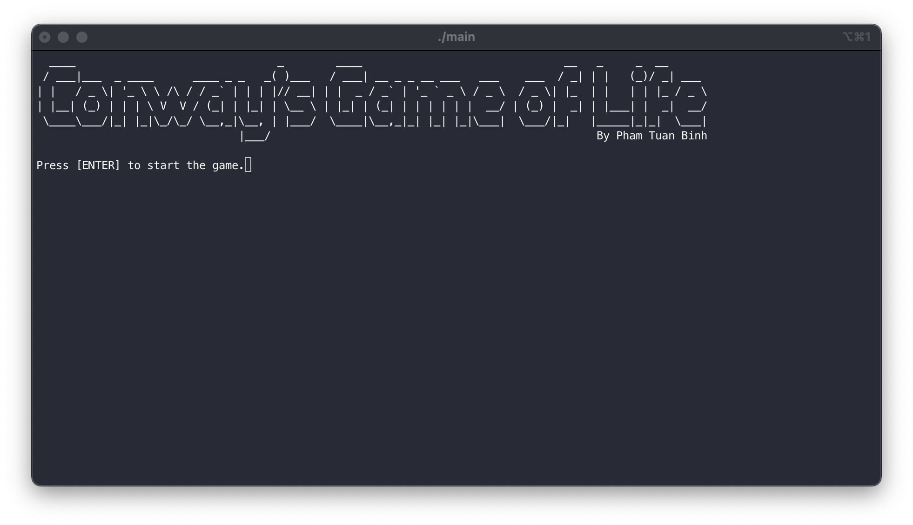
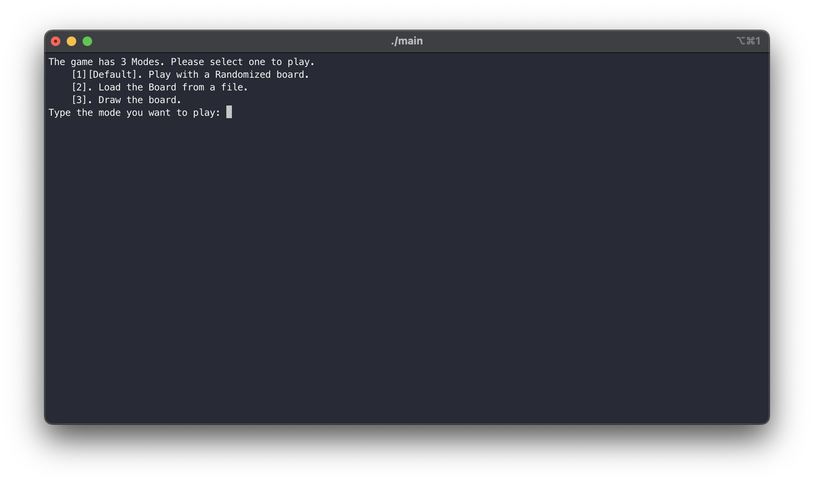
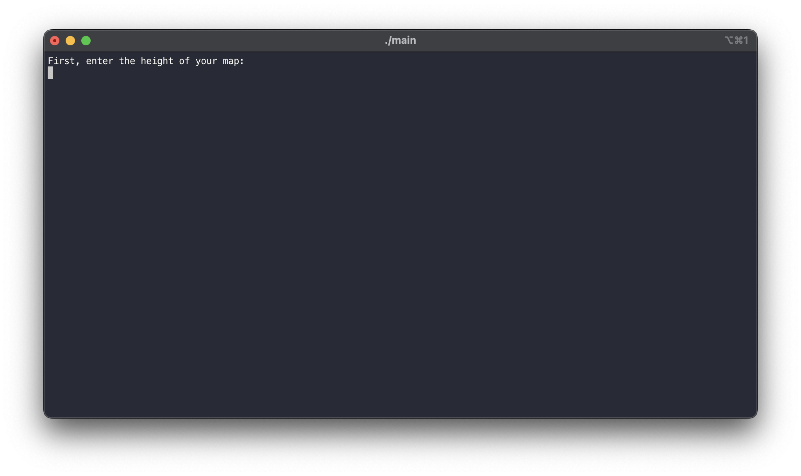
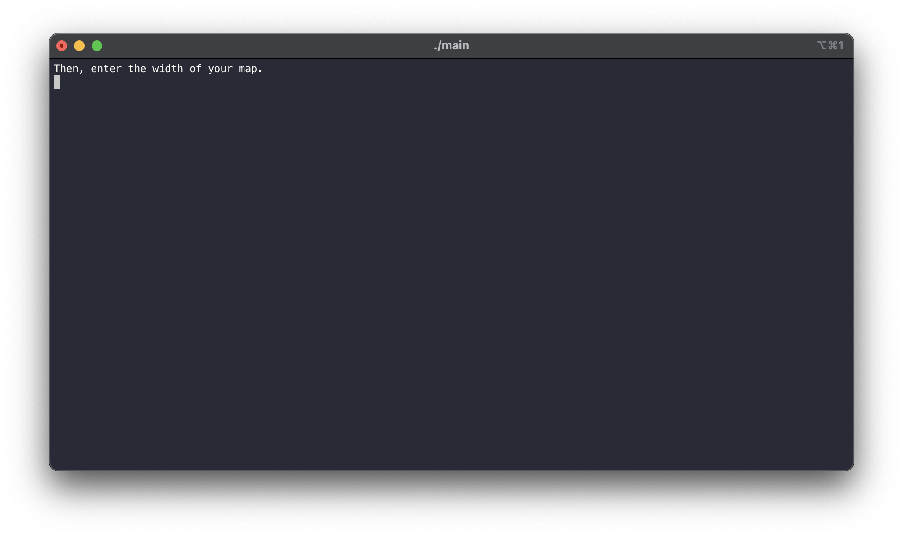
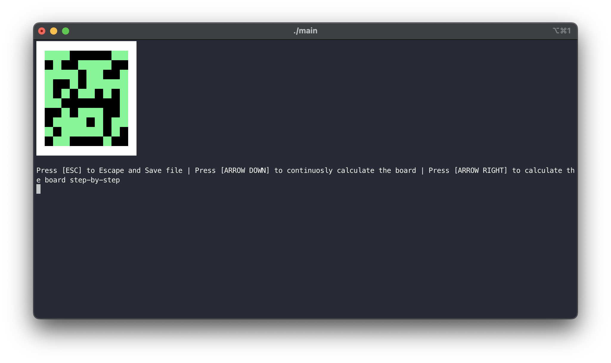
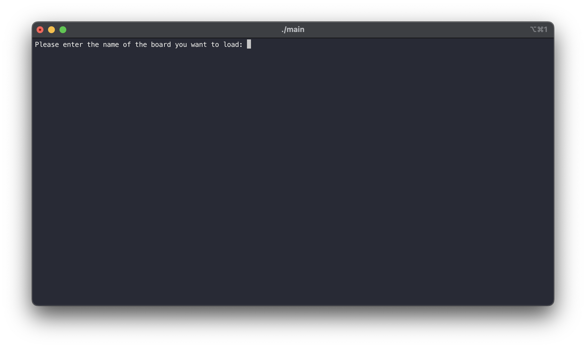
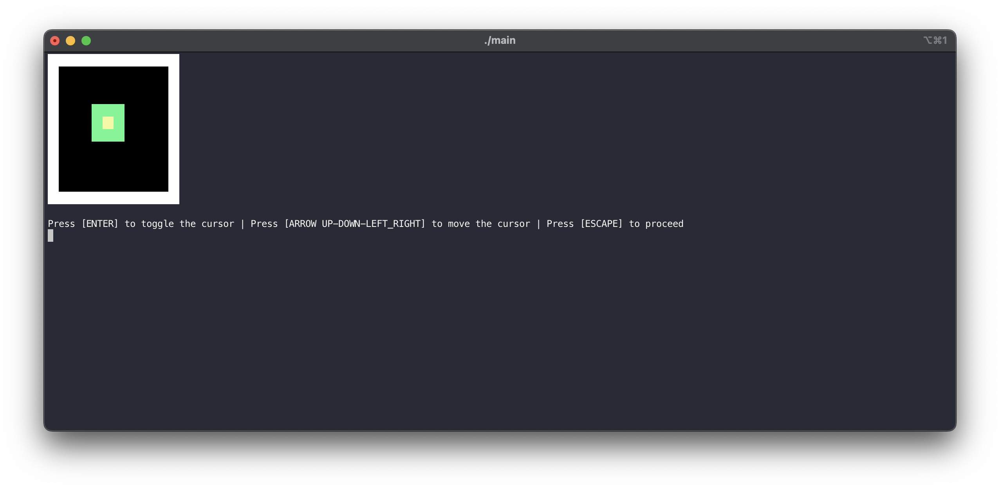
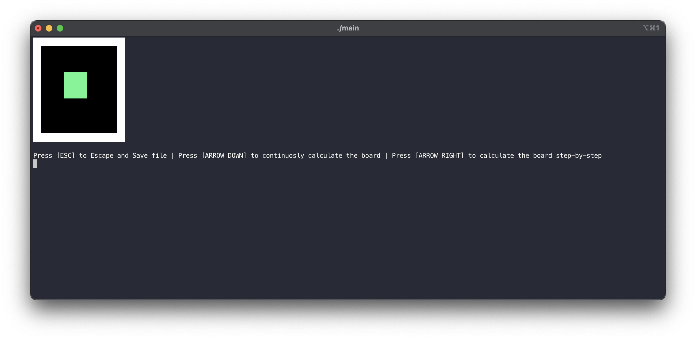
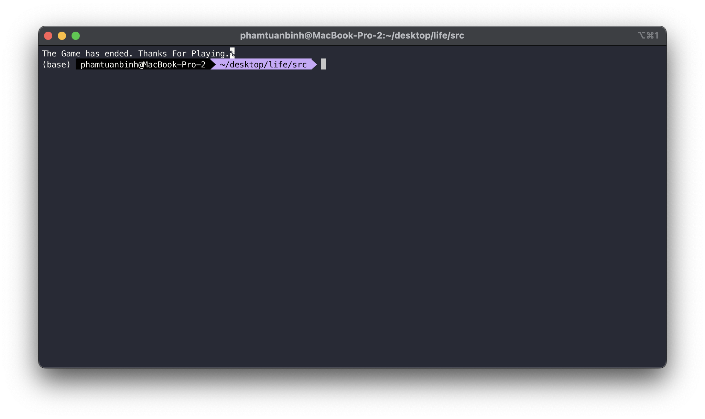
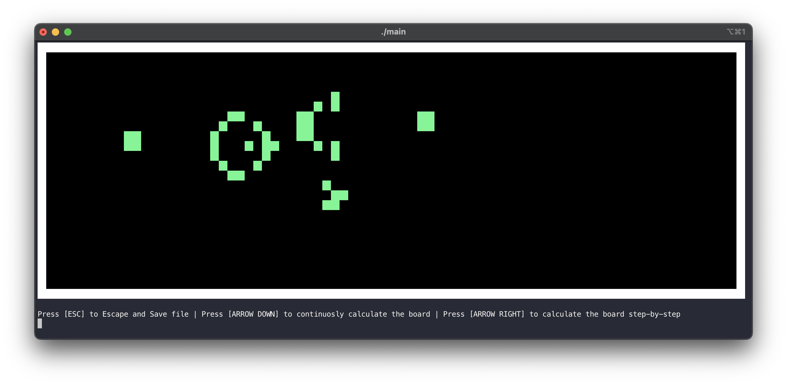

# Manual

## 1. Compilation of the game

This game was packed by me by hand with the help of CMake. Below is the **file structure of the project**:

```
./docs: All docs are stored here
./include: Libraries Headers are stored here. In this case, only econio.
./src: Source code of the game and of the libraries.
    ./src/obj: obj files (artifacts of the compilation process).
```

To build the game, we need **4 libraries**:

- stdio.h
- stdlib.h
- unistd.h
- econio.h

These libraries should be on your computer, except for **econio.h**, which is already include in the **src** folder.

To compile and run the game, you will nead to run these commands from the ./ of this game.

```ZSH
$ cd src
$ make
$ ./main
```

In case, you can't run the game due to some enviroment incompatibility. There is a packed and compiled file for you to run.

```ZSH
$ ./main
```

## 2. Game Manual

### 2.1 How to start the game

After compiling the game, you can **start the game** by:

```ZSH
$ ./main
```

After that command, you will be greeted with this screen:



At which, you need to press **ENTER** to proceed.

### 2.2 Which game mode to choose

After pressing **ENTER**, you will be seeing a menu screen:



By **entering a number** according to the available options, you will be directed into **different modes**.

#### 2.2.1 Mode 1: Randomized board

If you choose **Mode 1**, you will need to **enter the height and width** of the board according to the screens:




After which, you will be greeted with the board itself and be able to control it.



You can **control the board** according to the instructions on the screen.

#### 2.2.2 Mode 2: Load board from file

If you choose **Mode 2**, you will need to **enter the name of the file you want to load** (Remember this file has to be previously generated by the game itself):



After which, you will be greeted with the board itself and be able to control it.


You can **control the board** according to the instructions on the screen.

#### 2.2.3 Mode 3: Draw board

If you choose **Mode 3**, you will need to **enter the height and width** of the board according to the screens:


After which, you will be presented with **a blank board** on which you can draw on:



You can **draw on the board** according to the instructions on the screen.

After **pressing ESCAPE**, you will be greeted with the board you have drawn and be able to control it.



You can **control the board** according to the instructions on the screen.

### 2.3 How to end the game and save the file

If you are bored, you can **save the current state of your board** by **pressing ESCAPE** while in animation process. This will lead you to a screen where you can type the name of the save file:


After **entering the name**, you will be **greeted with a game ending note**.



## 3. Easter Egg

There won't be anything fancy like if you enter a special sequence, the game does something weird (There just might be (｡•̀ᴗ-)✧ ).

But I have included the source a **special save_file** called **gasper_gun** which create a gun in **Conway's Game of Life**. It is pretty cool in **Continous Animation Mode**.



## 4. End Note

Thank you for spending your time with me and this manual. I hope you enjoy playing the game!
